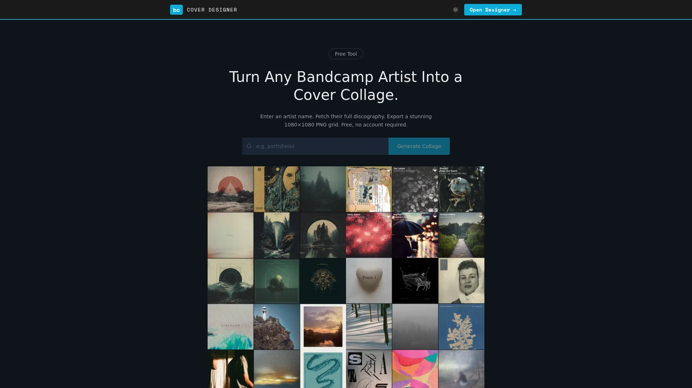

# Bandcamp Cover Designer

> Turn any Bandcamp artist into a stunning cover collage — export a crisp 1080×1080 PNG in seconds.



**[→ Live Demo](https://bandcamp-designer.the-moon-records.de)** · Free · No account required

---

## Features

| | |
|---|---|
| 🎨 **8 Layouts** | 1×1 up to 5×5, plus an asymmetric Bento mode |
| 🖼 **Release Filter** | Toggle individual covers in/out via a slide-in panel or mobile bottom sheet |
| 🎛 **Gap Control** | Adjustable spacing between covers (0–16 px) |
| 🌈 **Background Color** | Presets + custom color picker |
| 🔀 **Shuffle** | Randomize the release order in one click |
| 🏷 **Branding Overlay** | Artist name + `.bandcamp.com` burned into the canvas |
| ↓ **PNG Export** | 1080×1080 px, timestamped filename |
| 🔗 **Shareable URL** | `/app?artist=portishead` — link directly to any artist |
| 🌙 **Dark Mode** | Default dark, persisted per browser |

---

## Getting Started

**Prerequisites:** Node.js 18+, pnpm

```bash
pnpm install
pnpm dev
```

Open [http://localhost:5173](http://localhost:5173).

---

## Layouts

| Mode  | Grid | Albums needed | Notes |
|-------|------|:---:|---|
| 1×1   | 1×1  | 1 | |
| 2×2   | 2×2  | 4 | |
| 2×3   | 2×3  | 6 | portrait format |
| 3×2   | 3×2  | 6 | landscape format |
| 3×3   | 3×3  | 9 | |
| 4×4   | 4×4  | 16 | |
| 5×5   | 5×5  | 25 | |
| **Bento** | asymmetric | 5 | 2×2 hero + 1×2 side + 3 small |

Layouts that require more albums than available are automatically hidden.

---

## How it Works

1. Enter an artist name or Bandcamp URL — the app strips the protocol and `.bandcamp.com` suffix automatically
2. The backend scrapes the artist's music page, extracts the `band_id`, and queries Bandcamp's mobile API
3. Cover images are proxied through `/api/image` to bypass CORS restrictions in the Canvas export
4. The Canvas API renders everything at 1080×1080 px and exports a lossless PNG

---

## Production Build

```bash
pnpm build
node server.mjs
```

The production server (`server.mjs`) serves `dist/` and mirrors the same `/api/bandcamp` and `/api/image` endpoints as the Vite dev middleware. Port `8080` by default, configurable via `PORT` env var.

## Docker

```bash
docker build -t bandcamp-designer .
docker run -p 8080:8080 bandcamp-designer
```

## Deployment

Running at [bandcamp-designer.the-moon-records.de](https://bandcamp-designer.the-moon-records.de) via Kubernetes + ArgoCD.  
Pushing to `main` → GitHub Actions builds and pushes `ghcr.io/tobeworks/bandcamp-designer:latest` → ArgoCD image-updater detects the new digest and rolls out automatically.

## Testing

```bash
pnpm test
```

Playwright E2E tests in `tests/collage.spec.ts`.

---

## Tech Stack

- [Vue 3](https://vuejs.org) Composition API · [Vite](https://vitejs.dev) · TypeScript
- Tailwind CSS v4 with semantic design tokens + dark mode
- [node-html-parser](https://github.com/taoqf/node-html-parser) — Bandcamp HTML scraping
- Native Canvas API — collage rendering + PNG export
- pnpm · Playwright · Docker · GHCR · ArgoCD

---

Built by [tobeworks.de](https://tobeworks.de) · [GitHub](https://github.com/tobeworks/bandcamp-cover-designer) · [Impressum](https://tobeworks.de/impressum) · [Datenschutz](https://tobeworks.de/datenschutz)
